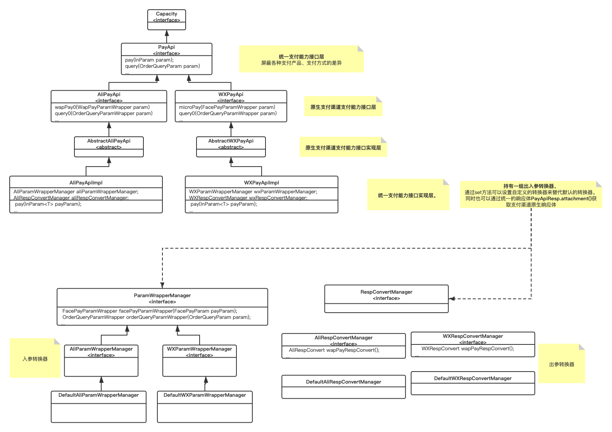
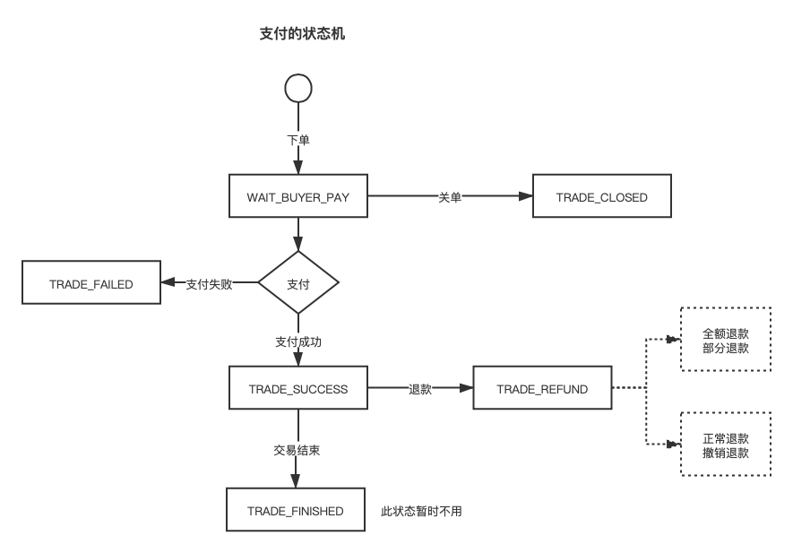

# 实现了微信、支付宝支付能力接口，并统一了下单，查询等接口

## TODO

- 微信金额转换。(完成)
- 微信订单转换。(完成)
- payApi接口返回的tradeStatus是支付渠道原生的内容,一：通过payApiService来实现订单状态的统一。二：直接在payApi接口中统一转换。(完成)
- PayApiService更上层的一种抽象。(完成)
- 所有入餐增加一个Object对象（做通用适配）
- 相应中携带原始入参

## 架构图



## 支付状态机



## 用法一

### 统一支付接口

```
    public void pay() throws Exception {
        String serverUrl = "https://openapi.alipay.com/gateway.do";
        String aliAppId = "";
        String aliAppPrivateKey = "";
        String format = "json";
        String charset = "UTF-8";
        String alipayPublicKey = "";
        String aliSignType = "RSA2";

        AlipayClient alipayClient = new DefaultAlipayClient(serverUrl, aliAppId,
                aliAppPrivateKey,
                format, charset, alipayPublicKey, aliSignType);

        PayApi payApi = new AliPayApiImpl(alipayClient);

        payApi.facePay(new FacePayParam<AlipayResponse>() {
            @Override
            public String outTradeNo() {
                return "123";
            }

            @Override
            public String totalAmount() {
                return "0.01";
            }

            @Override
            public String subject() {
                return "测试";
            }

            @Override
            public String scene() {
                return "bar_code";
            }

            @Override
            public String authCode() {
                return "284832742165939547";
            }
        });

    }
```

### 查询接口

```
    public void query() throws Exception {
        String serverUrl = "https://openapi.alipay.com/gateway.do";
        String aliAppId = "";
        String aliAppPrivateKey = "";
        String format = "json";
        String charset = "UTF-8";
        String alipayPublicKey = "";
        String aliSignType = "RSA2";

        AlipayClient alipayClient = new DefaultAlipayClient(serverUrl, aliAppId,
                aliAppPrivateKey,
                format, charset, alipayPublicKey, aliSignType);

        PayApi payApi = new AliPayApiImpl(alipayClient);

        PayApiResp<OrderQueryResp> payApiResp = (PayApiResp) payApi.query(new OrderQueryParam<Object>() {
            @Override
            public String tradeNo() {
                return null;
            }

            @Override
            public String outTradeNo() {
                return "123";
            }
        });
        System.out.println(payApiResp);
    }

```

## 用法二（更抽象、集成度更高统一接口）
### 初始化
```
  public WXPay createWXClient() {
        WXPayConfig wxPayConfig = new WXPayConfig() {
            @Override
            public String getAppID() {
                return null;
            }

            @Override
            public String getMchID() {
                return null;
            }

            @Override
            public String getKey() {//API 密钥 apiKey
                return null;
            }

            @Override
            public InputStream getCertStream() {
                return null;
            }

            @Override
            public int getHttpConnectTimeoutMs() {
                return 0;
            }

            @Override
            public int getHttpReadTimeoutMs() {
                return 0;
            }
        };
        WXPay wxpay = new WXPay(wxPayConfig);
        return wxpay;
    }
    
 public AlipayClient createAlipayClient() {
        String serverUrl = "https://openapi.alipay.com/gateway.do";
        String aliAppId = "";
        String aliAppPrivateKey = "";
        String format = "json";
        String charset = "UTF-8";
        String alipayPublicKey = "";
        String aliSignType = "RSA2";

        AlipayClient alipayClient = new DefaultAlipayClient(serverUrl, aliAppId,
                aliAppPrivateKey,
                format, charset, alipayPublicKey, aliSignType);
        return alipayClient;
    }

```
### 统一支付接口
```
    public void pay() throws Exception {
        WXPay wxPayClient = createWXClient();
        AlipayClient alipayClient = createAlipayClient();
        PayApiService payApiService = new PayApiService(alipayClient, wxPayClient);
        PayApiResp payApiResp = payApiService.pay(new UnitePayParam() {
            @Override
            public PayTypeEnum payType() {
                return PayTypeEnum.ALI_FACE_PAY;
            }

            @Override
            public String outTradeNo() {
                return null;
            }

            @Override
            public String totalAmount() {
                return null;
            }

            @Override
            public String subject() {
                return null;
            }

            @Override
            public String scene() {
                return null;
            }

            @Override
            public String authCode() {
                return null;
            }

            @Override
            public String timeExpire() {
                return null;
            }

            @Override
            public String notifyUrl() {
                return null;
            }

            @Override
            public String openId() {
                return null;
            }

            @Override
            public WXTradeTypeEnum tradeType() {
                return null;
            }
        });

        if (payApiResp.isSuccess()) {
            //根据payTyp不同得到不同的响应体
            System.out.println(payApiResp.data());
        } else {
            System.out.println("调用失败 " + payApiResp.printMsg());
        }

    }

```

### 统一查询接口
```
  public void query() throws Exception {
        WXPay wxPayClient = createWXClient();
        AlipayClient alipayClient = createAlipayClient();
        PayApiService payApiService = new PayApiService(alipayClient, wxPayClient);
        PayApiResp<OrderQueryResp> payApiResp = payApiService.query(new UniteOrderQueryParam<PayApiResp<OrderQueryResp>>() {
            @Override
            public PayTypeEnum payType() {
                return PayTypeEnum.ALI;
            }

            @Override
            public String tradeNo() {
                return null;
            }

            @Override
            public String outTradeNo() {
                return null;
            }
        });
        if (payApiResp.isSuccess()) {
            //根据订单状态判断
            System.out.println(payApiResp.data().tradeStatusDesc());

        } else {
            System.out.println("调用失败 " + payApiResp.printMsg());
        }

    }
```


